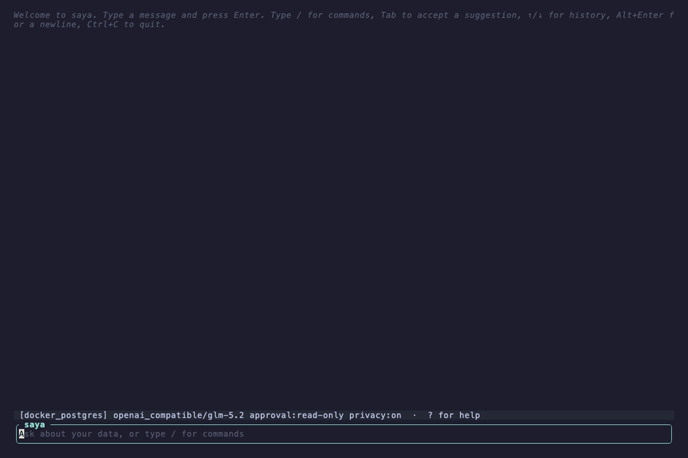
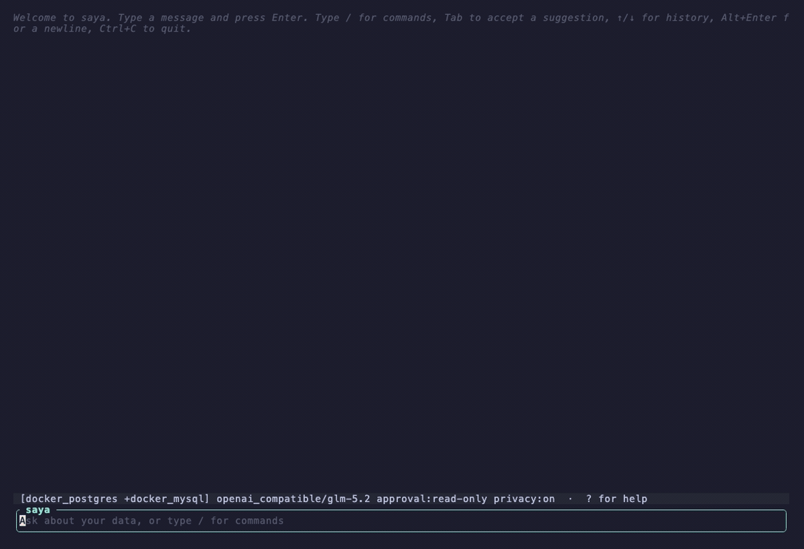
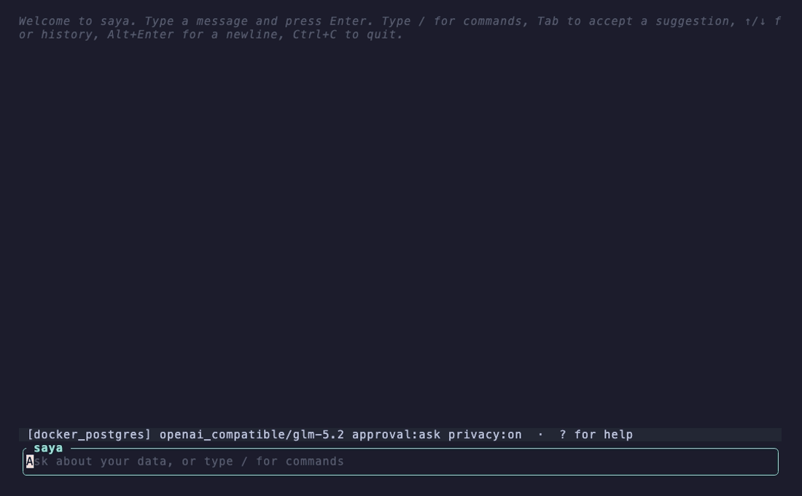

# SAYA CLI

SAYA CLI is an open-source, terminal-native shell for a database-aware AI agent.
Ask questions about your data in plain language and it discovers schema and runs
**bounded, read-only** SQL against PostgreSQL, MySQL, DuckDB, or Snowflake.

An interactive terminal (TTY) launches a **full-screen TUI** — a scrolling
transcript, a bottom-pinned input box, a slash-command popup that opens on `/`,
`@table` schema autocomplete, live streaming answers, and an approval prompt
before any query runs. Piped/non-TTY input uses a headless executor for scripts
and CI, with text/JSON/NDJSON output. Providers: Ollama, OpenAI,
OpenAI-compatible gateways, Anthropic, and Gemini. Sessions are redacted before
they are persisted, and multi-database navigation lets the agent query several
connected databases at once.

## Features

- 🖥️ **Full-screen TUI** — bottom-pinned input, scrolling transcript, live
  streaming answers, `/` command popup with fuzzy matching, and `@table` schema
  autocomplete.
- 🛡️ **Safe by default** — every query is bounded and read-only, with an
  approval prompt before it runs; sessions are redacted before being persisted.
- 🔌 **Databases** — PostgreSQL, MySQL, DuckDB, Snowflake; query several
  connected databases at once.
- 🤖 **Providers** — Ollama, OpenAI, OpenAI-compatible gateways, Anthropic,
  Gemini; configurable model and temperature.
- ⚙️ **Scriptable** — piped/non-TTY input runs headless with text/JSON/NDJSON
  output for scripts and CI.

## Demo

Ask in plain language — saya discovers the schema, runs bounded read-only SQL,
and streams the answer (here against a PostgreSQL then a MySQL database):



**Query across databases at once** — connect a second database and compare them
in a single question:



The command popup, fuzzy matching, and help overlay:



The GIFs are generated with [vhs](https://github.com/charmbracelet/vhs) from the
`docs/*.tape` scripts (the live ones need `SAYA_API_KEY` and reachable databases
in the environment).

## Install

Prebuilt binaries for macOS (Apple Silicon + Intel), Linux (x86_64), and Windows
(x86_64) are attached to every
[release](https://github.com/databook-studio/saya-cli/releases).

```bash
# Homebrew (macOS / Linux)
brew install databook-studio/tap/saya

# Cargo — prebuilt binary, no compile (cargo-bins.github.io/cargo-binstall)
cargo binstall saya-cli

# Cargo — from source (compiles the bundled DuckDB, so allow a few minutes)
cargo install saya-cli
```

Or download the archive for your platform from the
[releases page](https://github.com/databook-studio/saya-cli/releases), verify it
against `SHA256SUMS`, and put the `saya` binary on your `PATH`. See
[installation](docs/installation.md) for details.

## Quick start

```bash
cargo build --release --locked -p saya-cli
./target/release/saya config init
export SAYA_ANALYTICS_PASSWORD='use-a-read-only-password'
./target/release/saya config doctor
./target/release/saya connection test analytics
./target/release/saya --profile analytics --approval-mode read-only query --sql 'SELECT 1'
```

The five-minute path is: build from source, initialize the credential-free
`.saya/` templates, set the environment SecretRef used by the example profile,
then test a bounded read-only query. Running `saya` without a subcommand starts
the REPL; use `/help` for interactive commands. The automation surface is
available as `saya ask`, `saya query`, `saya config`, and `saya connection`.
See [installation](docs/installation.md) for source install details and the
current crates.io/Homebrew boundary.

For complete connection-profile, dotenv, query, and cross-database examples,
see the [database query guide](docs/querying-databases.md).

## Configuration

The canonical files are TOML:

```text
.saya/config.toml
.saya/connections.toml
~/.config/saya/config.toml
~/.config/saya/connections.toml
```

Session files default to the platform user-data directory: `SAYA_SESSION_DIR`
if set, then `$XDG_DATA_HOME/saya/sessions`, `%APPDATA%/saya/sessions`, or
`~/.local/share/saya/sessions`. The override is useful for tests and CI.

Use `--config` and `--connections` for explicit paths. Use `--env-file` to opt
into a dotenv-style file; `.env` is never loaded automatically. Process
environment values override explicit env-file values. Store only secret
references such as `{ env = "SAYA_ANALYTICS_PASSWORD" }`, never passwords or
API keys, in committed files. See [configuration](docs/configuration.md) and
[connections](docs/connections.md).

For a local Ollama setup, use a config file plus an explicit env file:

```toml
# .saya/config.toml
[ai]
provider = "ollama"
model = "qwen2.5-coder:14b"
base_url = "http://localhost:11434"
```

```dotenv
# .env.saya (do not commit)
SAYA_PROVIDER=ollama
SAYA_MODEL=qwen2.5-coder:14b
SAYA_PROVIDER_BASE_URL=http://localhost:11434
```

For an OpenAI-compatible service, use a runtime-only API-key reference:

```toml
[ai]
provider = "openai_compatible"
model = "your-model"
base_url = "https://api.example.test/v1"
api_key = { env = "SAYA_API_KEY" }
```

```dotenv
SAYA_API_KEY=replace-me
```

The connection file remains separate:

```toml
[profiles.analytics]
type = "postgresql"
host = "localhost"
port = 5432
database = "warehouse"
user = "saya_readonly"
password = { env = "SAYA_ANALYTICS_PASSWORD" }
sslmode = "require"
```

`saya config init` refuses to overwrite either project file and makes a
best-effort rollback after an ordinary creation error; it is not crash-atomic.
It emits one stable result event in text, JSON, or NDJSON. The generated
templates contain SecretRefs only; they never contain credentials.

MySQL uses the same SecretRef password pattern. Its safe default is
`verify-identity`; use `disable` only for an explicitly local development
server. Supported modes are `disable`, `prefer`, `require`, `verify-ca`, and
`verify-identity`:

```toml
[profiles.mysql]
type = "mysql"
host = "localhost"
port = 3306
database = "warehouse"
user = "saya_readonly"
password = { env = "SAYA_MYSQL_PASSWORD" }
sslmode = "verify-identity"
# ssl_ca = { file = "/etc/ssl/certs/mysql-ca.pem" }
```

Snowflake accounts use an account identifier such as `xy12345` or
`org-account.us-east-1.aws`, not a URL. Key-pair, password, and interactive
browser authentication are supported:

```toml
[profiles.snowflake_keypair]
type = "snowflake"
account = "org-account.us-east-1.aws"
user = "jane"
auth_type = "keypair"
private_key = { file = "/absolute/path/to/rsa_key.p8" }
passphrase = { env = "SAYA_SNOWFLAKE_PASSPHRASE" }
warehouse = "ANALYTICS"
database = "PROD"
schema = "PUBLIC"
role = "ANALYST"

[profiles.snowflake_userpass]
type = "snowflake"
account = "org-account.us-east-1.aws"
user = "jane"
auth_type = "userpass"
password = { env = "SAYA_SNOWFLAKE_PASSWORD" }

[profiles.snowflake_browser]
type = "snowflake"
account = "org-account.us-east-1.aws"
user = "jane"
auth_type = "externalbrowser"
```

File SecretRef paths are literal strings: `~` and environment variables are
not expanded. The current runtime supports `env` and `file` SecretRefs;
`{ keyring = "..." }` is a reserved shape and currently reports unavailable.
For an environment-only profile, use an explicit env file or process
environment with `SAYA_DB_TYPE`, `SAYA_DB_ACCOUNT`, `SAYA_DB_USER`, and
`SAYA_DB_AUTH_TYPE`, plus `SAYA_DB_PRIVATE_KEY` for keypair or
`SAYA_DB_PASSWORD` for userpass. Process environment overrides `--env-file`.
`SAYA_DB_PRIVATE_KEY` is raw PEM content. Because env files are line-oriented
and literal `\n` is not converted to a newline, put keypair PEM in a
connections.toml file SecretRef such as `{ file = "/absolute/path/to/rsa_key.p8" }`,
or provide raw multiline PEM through a process environment that preserves it.
Browser authentication requires an interactive TTY and opens a system browser;
it fails before binding, network, or browser launch with `--non-interactive` or
piped input, and the localhost callback expires after 120 seconds.

For a file-backed DuckDB profile, set `read_only` explicitly. `:memory:` may
omit it. DuckDB external access, extension autoloading, community extensions,
and persistent secrets are locked off by the CLI:

```toml
[profiles.local]
type = "duckdb"
path = "./data/warehouse.duckdb"
read_only = true
```

Run `saya --env-file .env.saya --connections .saya/connections.toml
--approval-mode read-only ask "show revenue"`. The newer provider env names
(`SAYA_PROVIDER`, `SAYA_MODEL`, `SAYA_PROVIDER_BASE_URL`, `SAYA_API_KEY`) have
the same precedence as the established `SAYA_AI_*` aliases.

```bash
saya config doctor
saya config show --resolved --redacted --format json
saya connection test analytics --connections examples/connections.toml
saya connection schema analytics --connections examples/connections.toml
saya --non-interactive connection test snowflake_keypair \
  --connections examples/connections.toml
saya --non-interactive connection schema snowflake_keypair \
  --connections examples/connections.toml
saya --non-interactive --env-file .env.snowflake \
  --profile snowflake_userpass connection test snowflake_userpass
saya --profile snowflake_browser connection test snowflake_browser
saya query --profile analytics --sql "SELECT current_database()"
saya --non-interactive --profile snowflake_keypair query \
  --sql "SELECT CURRENT_DATABASE()"
saya --profile snowflake_browser --approval-mode read-only ask \
  "summarize the selected schema"
saya connection test local --connections examples/connections.toml
saya query --profile local --connections examples/connections.toml --sql "SELECT 1"
saya --profile local --approval-mode read-only ask "summarize the local schema"
```

Schema discovery is cached in a private local SQLite state database. Live
authentication is always attempted first; stale fallback is explicitly marked,
and `connection schema --refresh` or interactive `/schema refresh` invalidates
before discovery. Set `SAYA_STATE_DB` to override the platform data path.

`--non-interactive` is valid for Snowflake keypair and userpass profiles, but
not for `externalbrowser`, which requires an interactive TTY.

## Privacy and limitations

The intended MVP policy is read-only, bounded queries with cloud row sharing
disabled. PostgreSQL, MySQL, DuckDB, and Snowflake reject parse failures, writes, DDL, transaction/control
statements, and multi-statements before execution. It observes one extra row to
mark truncated results. Schema discovery is auto-allowed; bounded SQL is
auto-approved only with `read-only`, denied with `never`, and explicitly
confirmed per query with `ask`. A non-TTY `ask` request is denied safely.
OpenAI, OpenAI-compatible, Anthropic, and Gemini providers are treated as
cloud: when sharing is disabled, they receive schema metadata but not SQL tools
or row data. Ollama is treated as local for this MVP. `/privacy`, `/model`,
`/provider`, and `/connect` apply to the next interactive prompt. `/include`
(and `--include-profile`) connect additional read-only databases, and the agent
navigates between all connected databases by passing an optional `connection`
argument to its schema and query tools; the primary database is the default.
Fully offline agent use and release signing are not implemented; provider
execution is Ollama / OpenAI-compatible only.
The database role must itself be read-only, and DuckDB file paths must have
least-privilege filesystem permissions: SQL AST checks cannot prove that an
arbitrary database function is free of side effects.
Resolved config secrets, provider headers, and raw query rows are structurally
excluded from session files. Known credential-shaped text is redacted, but
redaction cannot identify every arbitrary secret—never paste credentials into
prompts. See [SECURITY.md](SECURITY.md).

Unavailable or failed connection/schema operations return `3`, while safety and
query failures return `4`; provider/agent failures return `5`. Non-interactive
mode defaults to `never` approval (schema-only) unless `--approval-mode` is
explicit; interactive sessions default to `ask`. This MVP streams token
deltas from Ollama, OpenAI, OpenAI-compatible, and Anthropic chat providers, and returns Gemini
responses as a single buffered reply. Text output writes
deltas as they arrive; JSON and NDJSON each write one stable JSON event envelope per delta.
Requests retry retryable connection setup failures, HTTP 429, and 5xx responses only before the
provider yields an event. A body transport failure is surfaced without retry because replaying a
partially consumed response cannot be proved action-free. `Ctrl+C` cancels a one-shot request with
exit code 130; during an interactive request it returns to the `saya>` prompt without persisting
the incomplete turn. Interactive prompts and `--continue`/`--resume` use bounded, redacted
user/assistant history, and `/clear` removes visible and provider context. Session files persist
provider/model/profile/privacy/approval settings and safe tool name/status metadata. Database-derived
assistant turns are persisted locally after redaction but omitted from cloud provider history when
sharing is disabled; v1 files fall back to current runtime settings. Raw tool arguments, tool
responses, credentials, headers, and raw tool-result rows are not persisted or reconstructed as
provider history. A natural-language assistant answer may still contain database values.

## Development

```bash
cargo fmt --check
cargo test --workspace --locked
cargo clippy --workspace --all-targets --locked -- -D warnings
```

See [CONTRIBUTING.md](CONTRIBUTING.md). The project is Apache-2.0 licensed.
